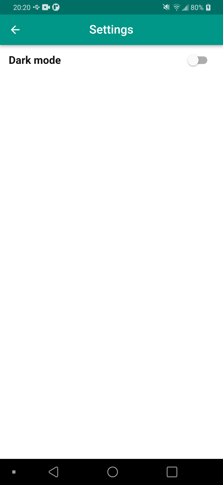

# Flutter Chat App

## Getting Started

### Core functions:
 - Sign up/Sign in  
 - Upload image profile
 - Send messages (text & image) to each other
 - Dark mode
 - Update personal info

### Demo

#### 1:

    
    
    

#### 2:

    
    
    

#### 3:

    
    
    

